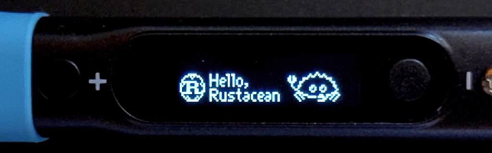

Pinecil GD32VF103 RISC-V Rust Demos
===



My personal collection of Rust demos running on the [PINE64 Pinecil][pinecil]
portable soldering iron, featuring a GD32VF103TBU6 Risc-V microcontroller.

I do not guarantee the correctness of any code in this repository.

[pinecil]: https://wiki.pine64.org/wiki/Pinecil


How to use
---

### Prerequisite

Obviously you'll need a Pinecil and a computer, and the USB Type-C cable to
connect the two.

A not-too-outdated Rust compiler is expected. I am using rustc 1.50.0.

You need to add the relevant Rust compiler target:

```
$ rustup target add riscv32imac-unknown-none-elf
```

You will also need a GNU binutils `objcopy` capable of producing a raw binary
file from an ELF file for flashing. Generally any `objcopy` tools should work,
but I've mostly been using `riscv-nuclei-elf-objcopy` from the Nuclei RISC-V
toolchain.

At last, you will need a tool to flash the resulting binary onto the device.
If you have ever updated the firmware of your Pinecil, you should already have
such a tool.

#### Optional goodies

- An official Pinecil breakout board is strongly recommended since it allows
  you to connect the UART and/or a JTAG debugger.
- A device to connect to the 3.3V UART is needed to make use of the UART, such
  as a USB to UART adapter, a single board computer like Raspberry Pi, or even
  an Arduino. Beware that if using a 5V UART device, you should not connect the
  TX pin of your device to the RX pin of the Pinecil directly, as the RX pin on
  the Pinecil is not 5V-tolerant. You can use a resistor voltage divider to
  convert the voltage level.
- It may be nice to have a debugging setup using a JTAG debugger. If you use a
  JTAG, you probably also want OpenOCD and GDB. (Also check out [my notes on
  connecting JTAG](./notes/01-JTAG.md).)
- An LED and a current-limiting resistor can be used to provide a binary
  output, as a simple indicator, or just to get started with a simple blinking
  LED demo.
- Jumper wires with DuPont connectors to connect the pins, and a breadboard
  to go with it.
- A multimeter is almost necessary for any electronics work.
- A digital oscilloscope or a logic analyzer can also come in handy.

### Running the demos

Building a demo is simple. This:

```
$ cargo build -p demo-00-blinky-raw-pointer --release
```

... will build the demo "00-blinky-raw-pointer" and produce the ELF file
`target/riscv32imac-unknown-none-elf/release/demo-00-blinky-raw-pointer`.

To produce a flashable firmware binary, use `objcopy`:

```
$ riscv-nuclei-elf-objcopy -O binary target/riscv32imac-unknown-none-elf/release/demo-00-blinky-raw-pointer firmware.bin
```

The resulting `firmware.bin` can be flashed with `dfu-util` or the
"GD32 Dfu Tool". The official [firmware updater][updater] is also capable of
flashing the file, since it uses `dfu-util` under the hood.

[updater]: https://github.com/pine64/pinecil-firmware-updater


Further reading
---

- Schematics of the Pinecil and breakout board, linked in the Pinecil page on
  the PINE64 Wiki
- GD32VF103 datasheet and user manual, linked in the Pinecil page on the PINE64
  Wiki
- The Embedded Rust Book: https://rust-embedded.github.io/book/
- Documentation of the various crates used:
    - `riscv-rt`: https://docs.rs/riscv-rt/0.8.0/riscv_rt/
    - `gd32vf103-pac`: https://docs.rs/gd32vf103-pac/0.4.0/gd32vf103_pac/
    - `gd32vf103xx-hal`: https://docs.rs/gd32vf103xx-hal/0.4.0/gd32vf103xx_hal/
    - `embedded-hal`: https://docs.rs/embedded-hal/0.2.4/embedded_hal/
    - `ssd1306`: https://docs.rs/ssd1306/0.5.1/ssd1306/
    - You can view a local version by running `cargo doc --open`.
- #gd32v-rust:matrix.org chat: https://matrix.to/#/#gd32v-rust:matrix.org
- PINE64 official Pinecil chat: Select from the top navigation bar on https://www.pine64.org/


Licence
---

All code and resources in this repository are released under the MIT License,
unless otherwise specified.

Rust and the Rust logo are trademarks owned by the [Rust Foundation].

[Ferris the crab] is created by *Karen Rustad Tölva* and has been
released into the Public Domain.

[Rust Foundation]: https://foundation.rust-lang.org/
[Ferris the crab]: https://www.rustacean.net/

---

Copyright (c) 2021 Alvin Wong

Permission is hereby granted, free of charge, to any person obtaining a copy
of this software and associated documentation files (the "Software"), to deal
in the Software without restriction, including without limitation the rights
to use, copy, modify, merge, publish, distribute, sublicense, and/or sell
copies of the Software, and to permit persons to whom the Software is
furnished to do so, subject to the following conditions:

The above copyright notice and this permission notice shall be included in all
copies or substantial portions of the Software.

THE SOFTWARE IS PROVIDED "AS IS", WITHOUT WARRANTY OF ANY KIND, EXPRESS OR
IMPLIED, INCLUDING BUT NOT LIMITED TO THE WARRANTIES OF MERCHANTABILITY,
FITNESS FOR A PARTICULAR PURPOSE AND NONINFRINGEMENT. IN NO EVENT SHALL THE
AUTHORS OR COPYRIGHT HOLDERS BE LIABLE FOR ANY CLAIM, DAMAGES OR OTHER
LIABILITY, WHETHER IN AN ACTION OF CONTRACT, TORT OR OTHERWISE, ARISING FROM,
OUT OF OR IN CONNECTION WITH THE SOFTWARE OR THE USE OR OTHER DEALINGS IN THE
SOFTWARE.
